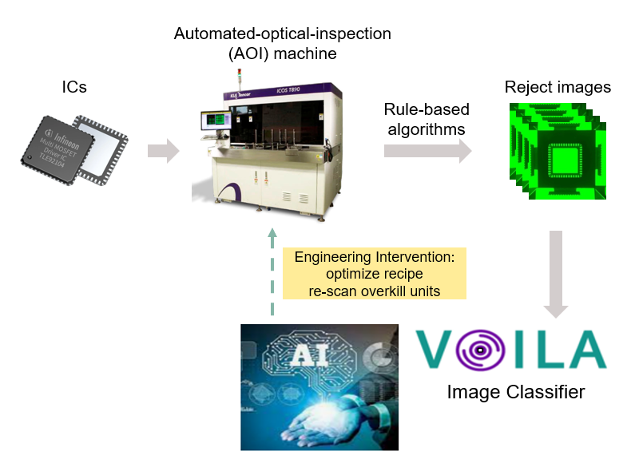
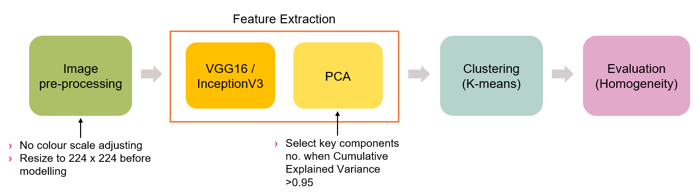
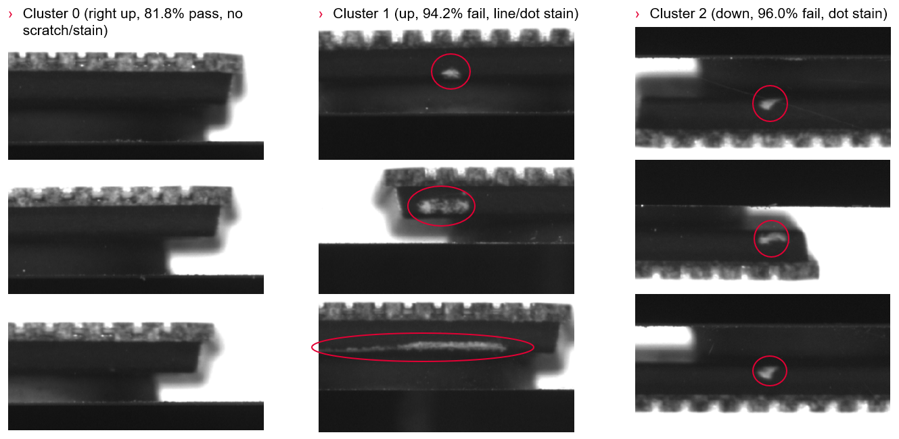

#  Capstone Project: Using Image Clustering for Auto Annotation of Defect ICs

## Table of Contents
- [Background](#Background)  
- [Problem Statement](#Problem-Statement) 
- [Dataset](#Dataset)
- [Executive Summary](#Executive-Summary)
- [Conclusions and Recommendations](#Conclusions-and-Recommendations)

## Background
Automated-optical-inspection (AOI) tools are deployed to ensure that the outgoing quality of integrated circuits (ICs) meets the required standards, playing a crucial role in the quality assurance process prior to shipment. However, the equipment used in AOI relies on rule-based algorithms, which unfortunately have low classification accuracy. An evaluation conducted on the AOI system revealed that approximately 50% of the images analyzed were either misclassified or falsely identified as failures. This presents a significant challenge as a high volume of images, approximately 100k, is generated on a daily basis, making it essential to address the accuracy issues of the AOI tools to improve the overall inspection process.

To enhance the optical inspection process, a solution based on the Deep Learning approach has been developed and implemented. This solution addresses several key objectives:
1. Recover false failures at point of process
2. Classify images accurately based on defined failure modes
3. Alert and trigger timely actions for lots with high overkill

The primary objective of implementing this solution is to enhance the business value by improving the yield and reducing the number of over-rejections. By leveraging the existing packages, the expected savings by the end of FY2223 are estimated to be €1.35 million. Furthermore, there is potential for even greater savings by extending the scope to include additional packages, defects, and different AOI machine models. 

[Return to top](#Table-of-Contents)  

## Problem Statement
To accommodate the scaling up of the Deep Learning model, including additional packages, defects, and different AOI machine models, an increased amount of labelled data is required for training. However, the current manual labeling process, performed by domain experts, is time-consuming. Therefore, the primary objective of this project is using image clustering for auto annotation to reduce the time for manual labelling. 

[Return to top](#Table-of-Contents)  

## Dataset
**Company in-house data (not open to the public)**: 3892 KLA 4-side defect bright mold images of VQ48 for initial trial (binary class pass/fail)

*KLA*: AOI machine model

*4-side defect bright mold*: defect mode

*VQ48*: IC package name

[Return to top](#Table-of-Contents)

## Executive Summary

### Exploratory Data Analysis (EDA)
We conducted an analysis of the image class distribution and color distribution within the dataset. By examining the ground truth labels of the images, we discovered that the data is unbalanced, with 61% of the images labeled as pass and 39% labeled as fail. However, despite this class imbalance, both pass and fail images exhibit the same color distribution. This information is valuable for performing image pre-processing tasks before the modeling stage.

Furthermore, we selected a subset of images from the dataset and sought the input of domain experts. Through this consultation process, we gained valuable insights. It was determined that pass images are characterized by their clarity and lack any white stains. On the other hand, fail images display stains of various shapes, such as lines or dots.

### Success Metrics for Evaluation
Since this is an unsupervised learning problem, we cannot rely on commonly used metrics like recall or F1 score, which are typically used for the evaluation of classification model. While intrinsic metrics such as Silhouette score and DB Index can provide some reference, they do not directly reflect the quality of image clustering. Therefore, we need to devise our own metrics based on the business context.

To evaluate the performance of our model, we have defined the following success metrics:

**Homogeneity**: We use ground truth labels (pass/fail) to calculate the percentage of the majority class within each cluster, similar to the concept of "precision" in classification. In the ideal case, every cluster should have 100% pass or 100% fail, indicating a clear separation of classes. Conversely, the worst case scenario is when each cluster contains a mixed distribution of 50% pass and 50% fail. In addition, we calculate the weighted **Average Cluster Homogeneity** using the equation below as an overall score to assess the model as a whole with the value range from 0.5 to 1.0.

### Modelling Methods
The image pre-processing stage begins with the omission of color scaling, as both pass and fail images demonstrate the same color distribution. However, we proceeded with image resizing to dimensions of 224 x 224 to ensure compatibility with the transfer learning model.

For feature extraction, we utilized VGG16 and InceptionV3 models. Subsequently, we employed PCA (Principal Component Analysis) to reduce the dimensionality of the extracted features. The threshold for selecting key components in PCA was set at a Cumulative Explained Variance of 0.95. This ensured that a significant portion of the variance in the data was retained while reducing its dimensionality.

Following feature extraction, we applied the k-means clustering algorithm to group the images into clusters. After that, the model's performance was evaluated using the aforementioned metrics (Homogeneity).

Three methods of transfer learning were applied for feature extraction. Firstly, the last fully connected layer of VGG16 was removed, serving as the baseline. Secondly, the last three fully connected layers of VGG16 were removed, followed by flattening the output. Lastly, InceptionV3 was utilized along with flattening the output.

Compared the feature extraction results of three methods, we observed that increasing the image vectors after flattening led to a corresponding increase in the number of key components in the PCA. This enhancement proved to be beneficial in improving the clustering results, as evident from the modeling outcomes. Notably, among the three methods employed, InceptionV3 demonstrated the ability to extract the highest number of features.

### Modelling Results
Starting with the baseline model results, we plotted the relationship between Average Cluster Homogeneity and the number of clusters (k). The highest homogeneity value was achieved when k was set to 6. Consequently, we utilized k=6 to calculate the homogeneity of each cluster and compiled the results, including the majority class and cluster size. Notably, one cluster exhibited 100% fails, indicating complete separation, while the second-highest homogeneity was observed in a cluster with 96% fails. The Average Cluster Homogeneity for the baseline model was calculated as 0.748, with individual cluster homogeneities surpassing 68%.

In comparison to the baseline model, employing VGG16 with output flattening yielded improved results. Using k=6 as a reference, the homogeneity of each individual cluster increased, except for the two clusters that maintained their respective homogeneity of 100% and 96% fails. The Average Cluster Homogeneity rose to 0.806, and all cluster homogeneities surpassed 73%. These findings demonstrate that increasing the dimensionality of the image vectors after flattening leads to enhanced clustering outcomes.

When comparing VGG16 to InceptionV3, the results demonstrated a similar performance. Using k=6 for comparison as well, InceptionV3 showed an increase in the homogeneities of three individual clusters, while two clusters experienced a decrease. The Average Cluster Homogeneity was calculated as 0.809, with all cluster homogeneities exceeding 68%. However, when considering the feature extraction results, the fact that InceptionV3 extracted a larger number of features compared to VGG16 may not hold significant weight. This implies that InceptionV3 might not be as efficient as VGG16 in terms of feature extraction for our data.

To gain insight into the characteristics captured by the model (VGG16 with output flattening for feature extraction), we selected representative images of the majority class from each cluster. Through this analysis, we observed that the model not only successfully captured prominent features such as various stains and image orientations, but it also detected subtle patterns like different scratch line variations that might go unnoticed to the human eyes. These findings indicate that the model has the potential to effectively group images with distinct characteristics into separate clusters. This capability becomes particularly valuable when transitioning to another dataset with different defect categories for next step. The model's ability to cluster images based on their features suggests that it can potentially exhibit good homogeneity in differentiating various defect categories as well.

[Return to top](#Table-of-Contents)

## Conclusions and Recommendations 
The most effective approach identified for our dataset was using VGG16 without last three fully connected layers along with flattening the output for feature extraction, combined with k-means clustering using k=6. This configuration yielded promising results, with an Average Cluster Homogeneity of 0.806 and individual cluster homogeneities above 73%. These outcomes demonstrate the potential to reduce the time required for manual labeling, as the model effectively groups similar images into distinct clusters. The developed model holds promise for the clustering of similar IC images, as it is expected to exhibit similar homogeneity within each cluster.

[Return to top](#Table-of-Contents)  