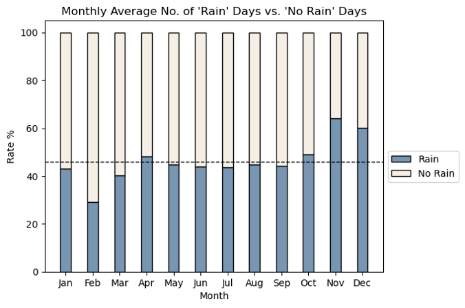

#  Project 1: Data Analysis of Singapore Rainfall

**Warning:** The Notebook contains API query which may take some time to run, if you encounter any warning or error message please re-run the code. If the query results show all empty values, please test the API link with Postman to see if the API link is still working.  

## Table of Contents
- [Problem Statement](#Problem-Statement)
- [Outside Research](#Outside-Research)
- [Data Dictionary](#Data-Dictionary)
- [Brief Summary of Analysis](#Brief-Summary-of-Analysis)
- [Conclusions & Recommendations](#Conclusions-&-Recommendations)
- [Citation](#Citation)

## Problem Statement
Public places at Singapore such as offices, MRT and shopping malls are often excessive cooling by aircon, which may result in energy wastes and health issues. This project aims to use the data to explain the significance of overcooling in air-conditioned offices in Singapore, especially on rainy days. The analysis results can help to design a building automation system which can adjust the aircon in offices according to the weather.

[Return to top](#Table-of-Contents)

## Outside Research
Singapore is not insulated from the impact of global warming. `From 1980 to 2020, the annual mean temperature has increased from 26.9°C to 28.0°C`. However, rainfall has become more intense in recent years. `The total annual rainfall for Singapore has increased at an average rate of 67 mm per decade from 1980 to 2019`. This kind of change in the climate will have effects on the daily life of residents. [Source link](https://www.nccs.gov.sg/singapores-climate-action/impact-of-climate-change-in-singapore/)

When our nature environment is getting hotter, the demand of aircon usage is growing at all of places in Singapore. It tends to have overusage especially on rainy days when outdoor temperature is decreasing. The issue may not be so significant at private homes since householders can take the control of the aircon to turn it off during rainy days. But public places like offices in a building are often excessive cooling, since usually there is no automation system to control the central aircon when it is raining. 

[Return to top](#Table-of-Contents)

## Data Dictionary
|Feature|Type|Dataset|Description|
|---|---|---|---|
|total_rainfall|float|rainfall_final|Monthly total rainfall (mm) from 1982-2022| 
|no_of_rainy_days|int|rainfall_final|Monthly number of rainy days from 1982-2022|
|mean_rh|float|rainfall_final|Monthly mean relative humidity (%) from 1982-2022|
|year|int|rainfall_final, daily_weather_2021|Year| 
|month|int|rainfall_final, daily_weather_2021|Month| 
|day|int|daily_weather_2021|Day|
|daily_rainfall_total_(mm)|float|daily_weather_2021|Daily total rainfall (mm) in 2021 @Changi|
|mean_temperature_(°c)|float|daily_weather_2021|Daily mean temperature (°C) in 2021 @Changi|
|relative_humidity_(%)|float|daily_weather_2021|Daily relative humidity (%) in 2021 @Changi|
|weather_condition|string|daily_weather_2021|Daily weather condition in 2021 @Changi (A day is considered “rained” if the total rainfall for that day is 0.2mm or more)|

[Return to top](#Table-of-Contents)

## Brief Summary of Analysis
Historical data shows that almost half (46%) of the days were raining over the past 40 years in Singapore. And almost half of the month is raining for most months in a year, except that Feb has relatively fewer rainy days while Nov and Dec have relatively more rainy days. 

According to the data of daily weather in 2021, the median outdoor temperature during non-rainy days is 28.5 °C while the median outdoor temperature during rainy days is relatively low, at 27.5 °C; the median relative humidity during non-rainy days is 75.3 % while the median relative humidity during rainy days is relatively high, at 81.2 %.

[Return to top](#Table-of-Contents)

## Conclusions & Recommendations
1. Rainfall is quite significant in Singapore, almost half (46%) of the days were raining over the past 40 years. If we tie this to the issue of overcooling being worsened especially on rainy days, it proves a building automation system based on raining status is meaningful.
2. Historical data suggested that in average Nov and Dec can have the highest monthly no of rainy days and total rainfall in a year. The building automation system will mainly operate in Nov and Dec which are the rainy seasons. 
3. During rainy days, the outdoor temperatures will be relatively low and the relative humidity will be relatively high, which could significantly exacerbate the overcooling problem of the aircon in offices. The building automation system can control to turn off the aircon and replace with natural ventilation to solve the overcooling issue.  

[Return to top](#Table-of-Contents)

## Citation
1. [data.gov.sg](https://data.gov.sg/)
2. [Weather data from The Meteorological Service Singapore (MSS)](http://www.weather.gov.sg/climate-historical-daily/)
3. [National Environment Agency API](https://api.data.gov.sg/v1/environment/relative-humidity)

[Return to top](#Table-of-Contents)
