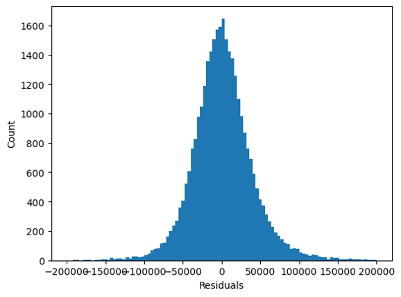
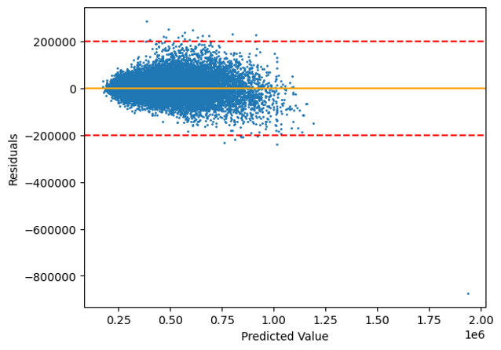

#  Project 2: Singapore Housing Price Prediction

## Table of Contents
- [Background](#Background)  
- [Problem Statement](#Problem-Statement) 
- [Data Dictionary](#Data-Dictionary)
- [Executive Summary](#Executive-Summary)
- [Conclusion and Recommendation](#Conclusion-and-Recommendation)  

## Background
HDB (Housing and Development Board) flats are public housing units in Singapore, constructed and subsidized by the government to provide affordable housing options to citizens. They are a popular choice for first-time homebuyers in the country. There are two options for purchasing an HDB flat: applying for a new Build-To-Order (BTO) unit or buying a resale HDB flat from the open market.

Resale HDB flats are a convenient option for those who don't want to wait for BTO units to be built as they typically take several years to complete. However, resale flats tend to be more expensive compared to BTO units which are sold at the prices below market value by HDB. It is important to estimate the resale price of HDB flat in the open market to ensure a fair deal for both the buyer and seller. Both parties can benefit from having a sense of the fair market value for the HDB flat.

[Image Source](https://blog.seedly.sg/which-should-you-get-bto-vs-resale/)

[Return to top](#Table-of-Contents)  

## Problem Statement
As data scientists working for a real estate agent, our goal is to empower prospective householders and sellers to make informed decisions about property purchases and sales. Our main objectives are:

**- Using Singapore public housing data from 2012 to 2021, develop a regression model that accurately predicts the resale price of HDB flats in Singapore with a high degree of precision.**

**- Identify the top 5 features that have the greatest positive correlation to the resale price so that buyers and sellers can take this information into consideration.**

Data files & materials: [DSI-SG-Project-2 Regression Challenge](https://www.kaggle.com/competitions/dsi-sg-project-2-regression-challenge-hdb-price/overview)

[Return to top](#Table-of-Contents)  

## Data Dictionary
The final data has 95 columns (94 features + 1 target variable) which contains 167371 HDB flat resale records (150634 for train set and 16737 for test set) from 2012 to 2021.
|Feature|Type|Description| 
|---|---|---|
|resale_price|float|property's resale price in Singapore dollars. This is the target variable that we are trying to predict| 
|town|uint|HDB township where the flat is located, e.g. BUKIT MERAH (one-hot encoded, 26 features)| 
|flat_model|uint|HDB model of the resale flat, e.g. Multi Generation (one-hot encoded, 20 features)| 
|flat_type|string|type of the resale flat unit, e.g. 3 ROOM (7 types in total)| 
|tranc_year|int|year of resale transaction|
|tranc_month|int|month of resale transaction| 
|mid_storey|int|median value of storey_range| 
|floor_area_sqft|float|floor area of the resale flat unit in square feet| 
|hdb_age|int|number of years from lease_commence_date to present year| 
|max_floor_lvl|int|highest floor of the resale flat| 
|year_completed|int|year which construction was completed for resale flat| 
|commercial|int|boolean value (0/1) if resale flat has commercial units in the same block| 
|market_hawker|int|boolean value (0/1) if resale flat has a market or hawker centre in the same block|
|multistorey_carpark|int|boolean value (0/1) if resale flat has a multistorey carpark in the same block|
|precinct_pavilion|int|boolean value (0/1) if resale flat has a pavilion in the same block| 
|total_dwelling_units|int|total number of residential dwelling units in the resale flat| 
|1room_sold|int|number of 1-room residential units in the resale flat| 
|2room_sold|int|number of 2-room residential units in the resale flat| 
|3room_sold|int|number of 3-room residential units in the resale flat| 
|4room_sold|int|number of 4-room residential units in the resale flat| 
|5room_sold|int|number of 5-room residential units in the resale flat| 
|exec_sold|int|number of executive type residential units in the resale flat block| 
|multigen_sold|int|number of multi-generational type residential units in the resale flat block|
|studio_apartment_sold|int|number of studio apartment type residential units in the resale flat block| 
|1room_rental|int|number of 1-room rental residential units in the resale flat block| 
|2room_rental|int|number of 2-room rental residential units in the resale flat block| 
|3room_rental|int|number of 3-room rental residential units in the resale flat block| 
|other_room_rental|int|number of "other" type rental residential units in the resale flat block|
|mall_nearest_distance|float|distance (in metres) to the nearest mall| 
|mall_within_500m|int|number of malls within 500 metres| 
|mall_within_1km|int|number of malls within 1 kilometre| 
|mall_within_2km|int|number of malls within 2 kilometres| 
|hawker_nearest_distance|float|distance (in metres) to the nearest hawker centre| 
|hawker_within_500m|int|number of hawker centres within 500 metres| 
|hawker_within_1km|int|number of hawker centres within 1 kilometre| 
|hawker_within_2km|int|number of hawker centres within 2 kilometres|
|hawker_food_stalls|int|number of hawker food stalls in the nearest hawker centre|
|hawker_market_stalls|int|number of hawker and market stalls in the nearest hawker centre|
|mrt_nearest_distance|float|distance (in metres) to the nearest MRT station|
|bus_interchange|int|boolean value (0/1) if the nearest MRT station is also a bus interchange|
|mrt_interchange|int|boolean value (0/1) if the nearest MRT station is a train interchange station|
|bus_stop_nearest_distance|float|distance (in metres) to the nearest bus stop|
|pri_sch_nearest_distance|float|distance (in metres) to the nearest primary school|
|vacancy|int|number of vacancies in the nearest primary school|
|pri_sch_affiliation|int|boolean value (0/1) if the nearest primary school has a secondary school affiliation|
|sec_sch_nearest_dist|float|distance (in metres) to the nearest secondary school|
|cutoff_point|float|PSLE cutoff point of the nearest secondary school|
|affiliation|int|boolean value (0/1) if the nearest secondary school has an primary school affiliation|
|mall_500m_to_1km|int|number of malls between 500 metres to 1km|              
|mall_1km_to_2km|int|number of malls between 1km to 2km|               
|hawker_500m_to_1km|int|number of hawkers between 500 metres to 1km|              
|hawker_1km_to_2km|int|number of hawkers between 1km to 2km|              
|age_of_built|int|number of years from tranc_year to year_completed|

[Return to top](#Table-of-Contents)

## Executive Summary

### EDA
We examined the target variable by histogram plot, it shows that most resale prices are in a range of **360,000** - **440,000** SGD. A strong right skewed means a lot resale prices are relatively high. We found that there is an approximate linear correlation between resale price and floor area. However, it has many outliers e.g. floor area > **3000** sqft but the price is lesser than **1.2** million and floor area is only ard **1125** sqft but it has the highest resale price which is more than **1.2** million.

We found that resale price of 7 different flat types show an ascending order of median values. **1 Room** has the lowest median value while **Multi-generation** has the highest median value. There are some overlaps of the resale price outliers of 3 Room, 4 Room, 5 Room and Executive, but in general the resale price range is also in an ascending order. It indicates that it probably will be better to use seperate models for different flat types to predict the resale price.

The heatmaps below show the top 5 features positively correlated to resale price for **2 Room**, **4 Room** and **Multi-generation**. Compared to the overall heatmap with all flat types included, the top 5 features for each flat type are quite different. For example, the most positively correlated feature is **'max floor level'** for **3 Room** and **4 Room** and **'hawker numbers within 2km'** for **5 Room**, **Executive** and **Multi-generation**. It indicates that using seperate models to predict the resale prices of different flat types will be meaningful.

    
    
    

### Modeling
The methodology we used is to split the models for different flat types. We believe the model should be different since the EDA results show that the key correlated features are different for each flat type. 

Below shows the results of the final models we selected and the normalized RMSE on the validation set for each flat type. The normalized RMSE value is between **0.053** to **0.086**.
|Model Name|Flat Type|Regression Model|Normalized RMSE on Validation Set|
|---|---|---|---|
|Model_1|1 ROOM|LinearRegression|0.06683| 
|Model_2|2 ROOM|LinearRegression|0.07313| 
|Model_3|3 ROOM|LASSORegression|0.08614| 
|Model_4|4 ROOM|LinearRegression|0.07959| 
|Model_5|5 ROOM|RidgeRegression|0.08074| 
|Model_6 (Model_exec)|EXECUTIVE|LinearRegression|0.07393| 
|Model_7 (Model_multi)|MULTI-GENERATION|LinearRegression|0.05287| 

We did an overall model evaluation on the validation set. We predicted the resale price for each flat type separately, then merge these results into a full validation dataset with predict values and actual values, then we can calculate the combine RMSE from there (refer to the results in [Conclusion and Recommendation](#Conclusion-and-Recommendation)). We also did normality check and equal variance check of the residuals and observed some outliers, which are from 3 room, 4 room, 5 room and executive.  

    
    

    
[Return to top](#Table-of-Contents)

## Conclusion and Recommendation  

### Conclusion
We built 7 models for each flat type to predict the resale price, in overall with a **R2 score** of **0.928** and **RMSE** of **39,415.31**. Besides, we were able to identify the **top 5 features** that were **positively correlated** to the **resale price** for **each flat type**, as shown in the results below: 

|   |1 Room|2 Room|3 Room|4 Room|5 Room|Exec|Multi|
|---|---|---|---|---|---|---|---|
|**1st**|tranc_month|4room_sold|max_floor_lvl|max_floor_lvl|hawker_within_2km|hawker_within_2km|hawker_within_2km|
|**2nd**|mid_storey|floor_area_sqft|floor_area_sqft|hawker_within_2km|max_floor_lvl|hawker_within_1km|hawker_market_stalls|
|**3rd**|tranc_year|max_floor_lvl|mid_storey|hawker_within_1km|hawker_within_1km|floor_area_sqft|hawker_food_stalls|
|**4th**|-|mid_storey|hawker_within_2km|mid_storey|hawker_within_500m|hdb_age|hawker_within_1km|
|**5th**|-|mall_within_500m|mall_within_2km|hawker_within_500m|mid_storey|affiliation|floor_area_sqft|

Generally speaking, **max floor level**, **number of hawkers/malls within a certain distance**, **floor area** and **mid storey** are the top positively correlated features, however the order of correlation varies depending on different flat types. 

### Recommendation
When considering purchasing an HDB resale flat, it's important to keep in mind that in general the **floor area** is typically the **most** significant factor affecting the resale price. Historical data shows same as common sense: larger flats tend to be more expensive. However, to get a more accurate estimate of what you can expect to pay, it's advisable to dive deeper into HDB transactions and pricing trends for **different flat types**.

For example, if you're looking to buy a **3 Room** or **4 Room** flat, you should pay close attention to the **maximum floor level** of the building as flats with higher maximum floor levels are often more expensive. On the other hand, if you're considering a **5 Room**, **Executive**, or **Multi-generation** flat, the **number of hawkers within 2km** is a key factor to consider. Historical data suggests that flats located in areas with more hawkers within 2km tend to command higher prices.

As a seller of an HDB resale flat, taking into account the information mentioned above can help you to maximize the value of your sale.

[Return to top](#Table-of-Contents)  

