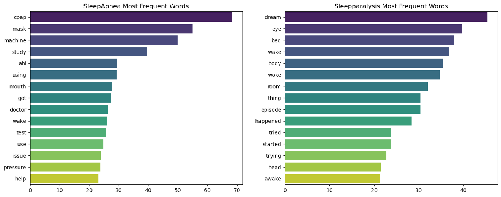

#  Project 3: Subreddit Classification

## Table of Contents
- [Background](#Background)  
- [Problem Statement](#Problem-Statement) 
- [Data Dictionary](#Data-Dictionary)
- [Executive Summary](#Executive-Summary)
- [Conclusion and Recommendation](#Conclusion-and-Recommendation)  
- [Requirements](#Requirements)

## Background
The importance of healthy sleep cannot be overstated. A lack of sleep or poor quality sleep can result in a variety of health issues, including obesity, diabetes, heart disease, and mental health problems such as anxiety and depression. It can also impair cognitive function, memory, and concentration, which can significantly impact daily activities such as work and driving. By prioritizing healthy sleep habits, individuals can improve their overall health and well-being.

[World Sleep Day](https://worldsleepday.org/) is an annual event that aims to raise awareness of sleep-related issues and promote healthy sleep habits. Celebrated on the Friday before the March Equinox each year, it provides an opportunity to highlight the importance of good sleep hygiene and encourage individuals to prioritize their sleep.

Locally, the [Singapore Sleep Society](http://singaporesleepsociety.org/) is a non-profit organization comprised of volunteers who work to organize events and activities that educate the public about the importance of healthy sleep and offer resources to help individuals achieve better sleep.

 

[World Sleep Day 2023 Logo](https://worldsleepday.org/toolkit) | [Singapore Sleep Society Logo](https://www.facebook.com/people/Singapore-Sleep-Society/100054198923611/)

[Return to top](#Table-of-Contents)  

## Problem Statement
We, as volunteers, are helping the Singapore Sleep Society in their goal of raising public awareness about healthy sleep habits on World Sleep Day 2023. As part of our efforts, we plan to **develop a web application that can assist individuals in identifying potential sleep disorders based on their reported sleep experiences**. Specifically, we will focus on two disorders: *Sleep Apnea*, characterized by breathing interruptions during sleep, and *Sleep Paralysis*, which involves temporary paralysis upon waking up.

To build the application, we will use natural language processing (NLP) techniques to analyze text data from two subreddits: 'SleepApnea' and 'Sleepparalysis'. Our approach will involve **identifying key words and phrases in users' experiences** and **building a robust classification model that can accurately predict the likelihood of an individual having either Sleep Apnea or Sleep Paralysis**. This application will provide users with valuable insights into their sleep patterns and enable them to seek medical advice if necessary.

Data source: [Pushshift API](https://github.com/pushshift/api)

[Return to top](#Table-of-Contents)  

## Data Dictionary
The final cleaned data has 10 columns (9 features + 1 target variable) which contains 2991 records from two subreddits 'SleepApnea' and 'Sleepparalysis'.

|Feature|Type|Description| 
|---|---|---|
|subreddit|string|Two subreddits 'SleepApnea' and 'Sleepparalysis'. This is the target variable that we are trying to predict.|
|selftext|string|Original selftext of a submission|
|title|string|Original title of a submission|
|selftext_title|string|Combined original selftext and title|
|selftext_clean|string|Selftext after text clean|
|title_clean|string|Title after text clean|
|selftext_title_clean|string|Combined cleaned selftext and title|
|word_count|int|Word count for 'selftext_title_clean'|
|char_count|int|Character count for 'selftext_title_clean'|
|avg_word_length|float|Average word length for 'selftext_title_clean'|

[Return to top](#Table-of-Contents)

## Executive Summary

### Word Frequency Analyses (EDA)
We conducted word frequency analyses of two subreddits, 'SleepApnea' and 'SleepParalysis', using both CountVectorizer and TfidfVectorizer. These analyses allowed us to generate visual representations of the most commonly used words in each text corpus. The plot generated by CountVectorizer revealed that for Sleep Apnea, the top three common words were **'cpap'**, **'mask'**, and **'machine'**, while for Sleep Paralysis, the top three common words were **'dream'**, **'bed'**, and **'wake'**. In order to provide additional context for these words, we supplemented our analysis with a 2-gram plot that visualized the most commonly used phrases in each corpus. The top three common phrases for Sleep Apnea were **'cpap machine'**, **'using cpap'**, and **'face mask'**, while for Sleep Paralysis, the top three common phrases were **'open eye'**, **'eye closed'**, and **'lucid dream'**.
#### Word frequency analyses by CountVectorizer (single words and phrases)

The word frequency plot generated by TfidfVectorizer is similar to that of CountVectorizer, but it offers the added advantage of quantifying the frequency of each word while also taking into account its importance in the entire corpus. This leads to more precise analysis, particularly when dealing with frequently occurring but less meaningful words. Upon analysis, we found that the top three common words for Sleep Apnea remained the same as those in the plot generated by CountVectorizer: **'cpap'**, **'mask'**, and **'machine'**. However, for Sleep Paralysis, the top three common words were changed to **'dream'**, **'eye'**, and **'bed'**. We also analyzed the 2-gram plot and found that the top three common phrases remained the same as those in the plot generated by CountVectorizer. However, the top 10 common phrases were different from the previous analysis. 
#### Word frequency analyses by TfidfVectorizer (single words and phrases)

### Modelling
We used two vectorizers, namely the **CountVectorizer** and **TfidfVectorizer**, along with two classifiers, **Naive Bayes** and **Logistic Regression**, to determine the best combination for our final production model. 

CountVectorizer converts a collection of text documents to a matrix of token counts, where each row represents a document and each column represents a unique word in the corpus. Conversely, TfidfVectorizer takes into account not only the frequency of words in the document but also the inverse document frequency, which penalizes words that appear in many documents and are therefore less informative. 

Naive Bayes is a probabilistic model that makes predictions based on the probability of a document belonging to a certain class, given its features (words in this case). Naive Bayes assumes that all features are independent of each other, hence the name "naive". In contrast, Logistic Regression models the probability of a document belonging to a certain class using a logistic function. It's a simple and interpretable algorithm that can be easily implemented and understood. 

Ultimately, selecting the best performing model requires the appropriate evaluation of different models using relevant metrics such as accuracy, precision, recall, and F1 score. And we will checkout the explainability of each model as well before we have the final conclusion.  

**For each vectorizer + classifier, we will conduct the following process:**
- Features engineering with vectorizer
- Select classifier
- Train / Test
- Evaluation
- Explainability

**Summary of models performance is as shown below:** 
||Count + Naive Bayes|Tfidf + Naive Bayes|Count + Logistic Regression|Tfidf + Logistic Regression|
|:---:|:---:|:---:|:---:|:---:|
|Accuracy|0.9688|0.9666|0.961|0.9699|
|Precision (label: 1)|0.9675|0.9673|0.9651|0.9675|
|Recall (label: 1)|0.9754|0.9713|0.9631|0.9775|
|F1-Score (label: 1)|0.9714|0.9693|0.9641|0.9725|
|AUC|0.9949|0.9949|0.9937|0.9946|

Based on the summary, all models demonstrated good performance with high accuracy exceeding **0.96**. However, the **Tfidf + Logistic Regression** showed a slight advantage in recall and F1-score. Moreover, the interpretability of this model is feasible. Therefore, we decided to select the **Tfidf + Logistic Regression** as the final production model. 

[Return to top](#Table-of-Contents)

## Conclusion and Recommendation  
After conducting natural language processing techniques to analyze text data from relevant subreddits, we have developed a reliable classification model with an accuracy of **0.97** that predicts the likelihood of individuals having sleep disorders, specifically Sleep Apnea and Sleep Paralysis. As a further step, we have created a web application based on the classification model that provides immediate feedback to users about potential sleep disorders according to their reported sleep experiences, which can assist them in seeking medical advice if needed.

Our word frequency analyses revealed that the key words and phrases for Sleep Apnea and Sleep Paralysis are different. For Sleep Apnea, the top 3 keywords are **'cpap'**, **'mask'** and **'machine'**, while for Sleep Paralysis, the top 3 keywords are **'dream'**, **'eye'** and **'bed'**. The top 3 common phrases for Sleep Apnea are **'cpap machine'**, **'using cpap'** and **'face mask'**, whereas for Sleep Paralysis, they are **'open eye'**, **'eye closed'** and **'lucid dream'**. These key words and phrases carry the most weight in our classification model.

[Return to top](#Table-of-Contents)  

## Requirements
lime 0.2.0.1

pickle5 0.0.12

Flask 2.2.3

[Return to top](#Table-of-Contents)  
